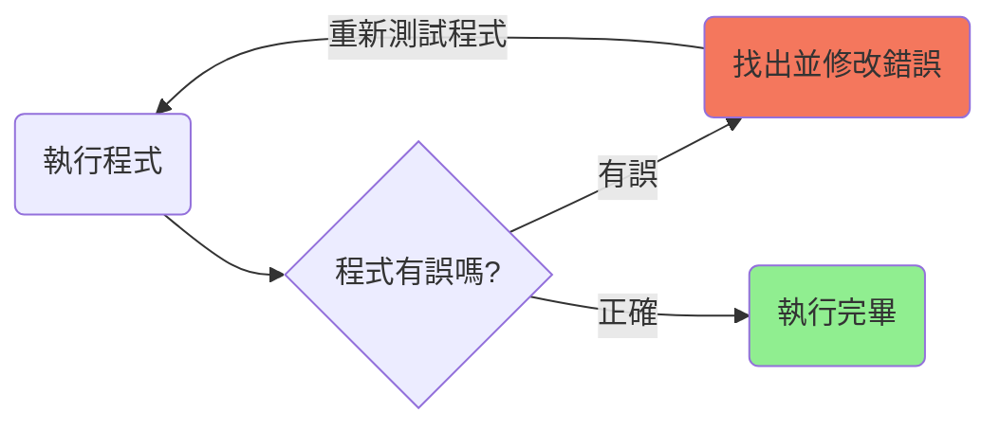

# 尋找並修正程式錯誤

目標：找出程式錯誤並加以修正。

## 簡介

你在寫程式碼時很容易出錯。會導致你的程式無法正確執行，這樣的錯誤稱為**程式錯誤** (Bug)，而找出並修正程式錯誤的過程稱為**除錯** (Debug)。

下方的程式碼包含一個或多個程式錯誤。若要為程式碼除錯，請將指令重新排列成正確的順序來通關。

1. 執行程式碼來查看哪裡發生錯誤
2. 找出位置不對的指令，然後按下指令來將它選取。
3. 將指令拖到正確位置，然後再次執行程式碼來進行測試。


## 講解

在程式開發的過程中，經常會出現各種錯誤，包括語法錯誤、邏輯錯誤等等。本單元將提供一段有小錯誤的程式碼，讓同學們嘗試找出錯誤，並加以修正。

下面是除錯的簡單流程：



## 解答

<!-- prettier-ignore -->
!!! danger "請務必嘗試解題"
    請同學務必嘗試自己解題，不要直接看答案。學習程式時最好的學習方法是自己嘗試解題，程式設計不會只有一種寫法，請通過不斷的嘗試和優化來找到屬於自己最好的解答。

```swift linenums="1"
moveForward()
moveForward()
turnLeft()
moveForward()
collectGem()
moveForward()
toggleSwitch()
```

## 後記

透過這個練習，你已經具有除錯的能力，下次，如果你的朋友有程式錯誤，你也可以嘗試幫他們找出錯誤並修正！
